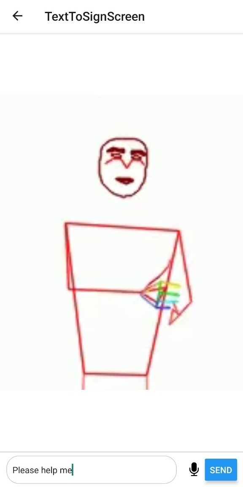
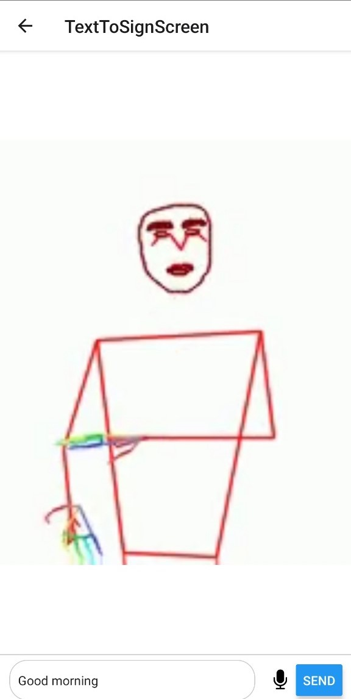

# Sign Language Translation App

 

This project is a mobile application that translates English language text into sign language animations. The app is built using React Native for the front end and FastAPI for the back end. Natural Language Processing (NLP) is utilized for translating English into sign language using NLTK (Natural Language Toolkit). Additionally, Jupyter notebooks are provided for preprocessing the sign videos dataset, cleaning the dataset, and generating animations using OpenPose and Matplotlib.

## Table of Contents

- [Features](#features)
- [Tech Stack](#tech-stack)
- [Installation](#installation)
- [Frontend Setup](#frontend-setup)
- [Backend Setup](#backend-setup)
- [Usage](#usage)
- [Screenshots](#screenshots)

## Features

- **English to Sign Language Translation:** Input English text and receive corresponding sign language animations.
- **NLP-Powered Translation:** Utilizes Natural Language Processing with NLTK to accurately translate English text into sign language.
- **Responsive Interface:** A user-friendly and responsive interface for easy navigation.
- **Real-time Translation:** Fast and accurate translation powered by the FastAPI backend.

## Tech Stack

- **Frontend:** React Native
- **Backend:** FastAPI
- **NLP:** NLTK (Natural Language Toolkit) for translating English text into sign language.
- **Pose Recognition Library:** OpenPose
- **Animation Library:** Matplotlib
- **Jupyter Notebooks:** For data preprocessing, cleaning, and animation generation

## Installation

### Prerequisites

- Node.js and npm installed on your system.
- Python and pip installed.
- (Any other prerequisites like libraries)

### Clone the Repository

```bash
git clone https://github.com/UnejucatedGuy/SignSarthi.git
cd SignSarthi
```

## Frontend Setup

### 1. Navigate to the frontend directory

```bash
cd SignSarathiClient
```

### 2. Install dependencies
```bash
npm install
```

### 3. Start the development server
```bash
npm start
```

### 4. Open the app
#### Open the app in an emulator or on a physical device using the QR code or URL provided by the development server.


## Backend Setup

### 1. Navigate to the backend directory:
```bash
cd SSbackend
```

### 2. Create and activate a virtual environment:
```bash
python -m venv venv
source venv\Scripts\activate
```

### 3. Install dependencies:
```bash
pip install -r requirements.txt
```

### 4. Run the FastAPI server:
```bash
uvicorn main:app --reload
```
#### The FastAPI server will start and be accessible at http://127.0.0.1:8000. You can use this URL to interact with the backend API.


## Usage
#### 1. Start both the frontend and backend servers.
#### 2. Open the mobile app in an emulator or physical device.
#### 3. Enter English text and receive the corresponding sign language animation.


## Screenshots

Here are some screenshots of the app showcasing different screens and features:

### Splash Screen and Home Screen

Below are screenshots of the Splash Screen and Home Screen:

<p align="center">
  
  
</p>

### Sign Language Translation Screen

Here are some screenshots of the Sign Language Translation Screen, displayed side by side:

<p align="center">
  
  
  
  
</p>

*Translation Screen - Animation Example 1: Translated Animation for "Please Help Me".*  
*Translation Screen - Animation Example 2: Translated Animation for "Good Morning".*  
*Translation Screen - Animation Example 3: Translated Animation for "What is your name?".*  
*Translation Screen - Animation Example 4: Translated Animation for "Hello".*


